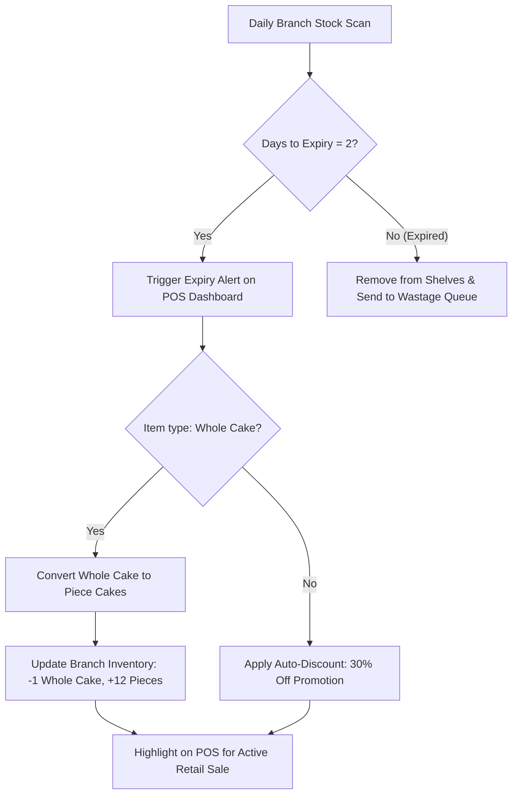
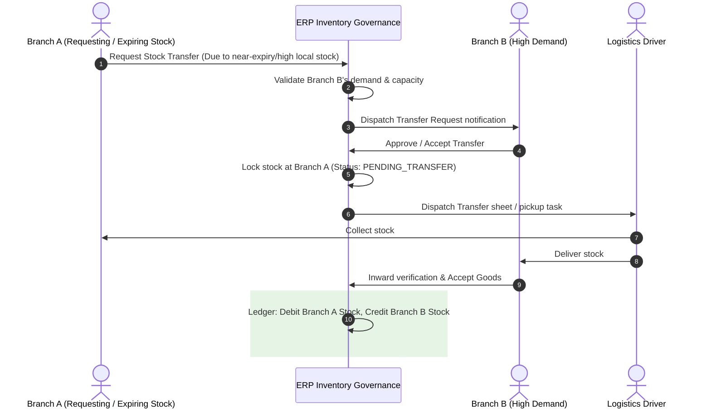
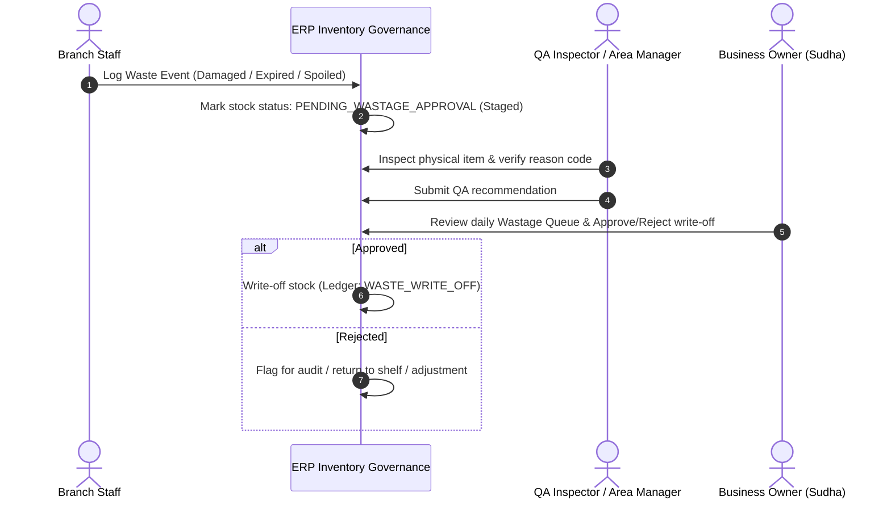
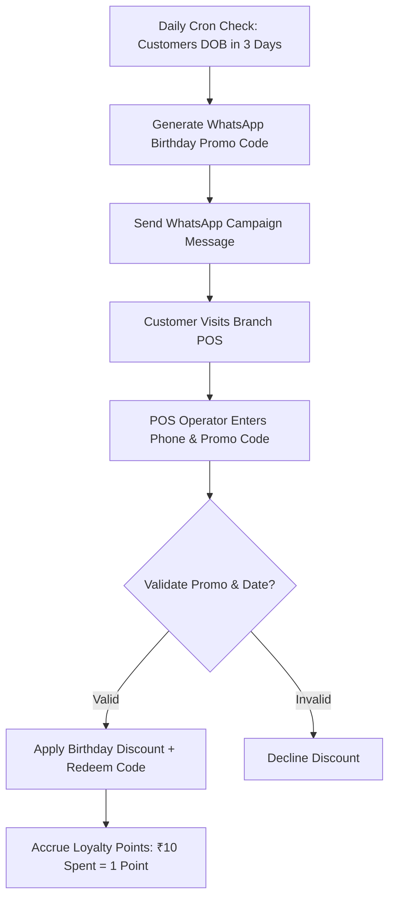
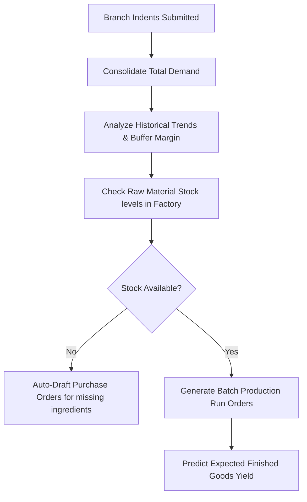

# 02. Business Process Mapping (BPM) - Bakery ERP Edition

This document details the Cakes & Candles-specific business processes, introducing the new **Inventory Governance** domain to control expiry, wastage, transfers, adjustments, audits, and ledger operations.

---

## 1. Expiry & Revenue Recovery Flow
Designed to prevent product waste by converting nearing-expiry inventory into revenue-generating formats.



---

## 2. Branch-to-Branch Transfer Flow
Enables inventory balancing across branches to prevent local expiry or address sudden demand surges.



---

## 3. Wastage Approval Workflow
Ensures all product write-offs are inspected and approved by upper management to prevent internal theft.



---

## 4. CRM & Campaign Automation Flow
Links POS data, birth dates, and automated channels to drive repeat visits.



---

## 5. Production Planning Engine
The manufacturing heart that drives daily factory operations based on actual data.



---

## 6. Inventory Ledger Flow (Double-Entry Movement)
Every single inventory change is logged as an auditable ledger entry.

```text
+-----------------------+      +-----------------------+      +-----------------------+
|   Opening Stock       |  --> |    Movement Transaction|  --> |    Closing Stock      |
|  (Verified Balance)   |      |  (Auditable Ledger Row)|      |  (Derived Real-time)  |
+-----------------------+      +-----------------------+      +-----------------------+
                                           |
                           +---------------+---------------+
                           |                               |
                   Additions (+)                    Deductions (-)
                   - Purchase (GRN)                 - Sales (POS Checkout)
                   - Production Yield               - Production Consumption
                   - Transfer In                    - Transfer Out
                   - Returns                        - Damage / Wastage / Expiry
```
