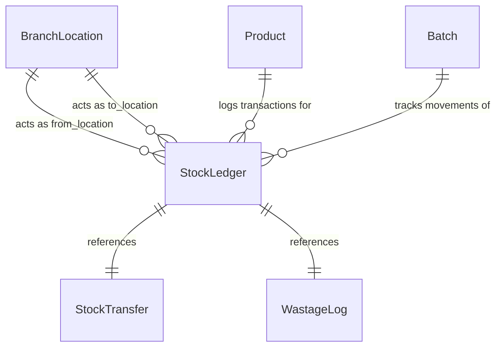
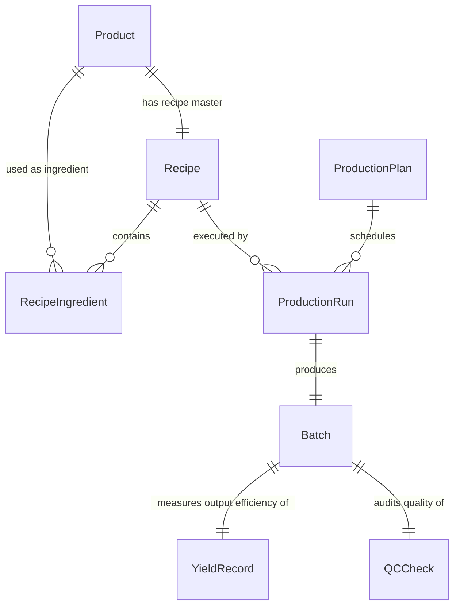
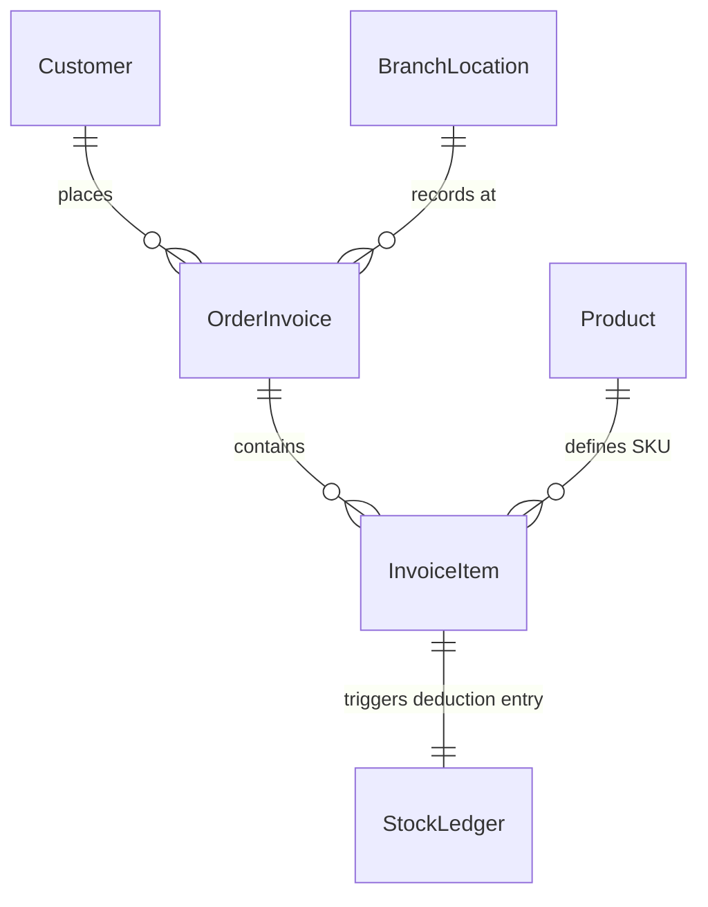
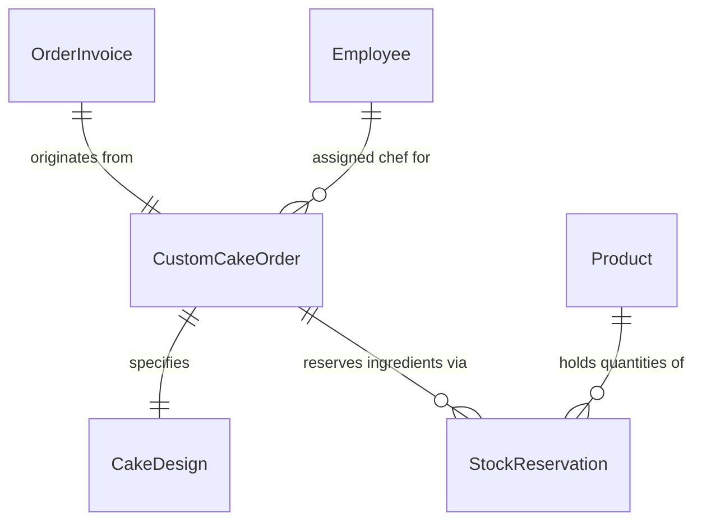
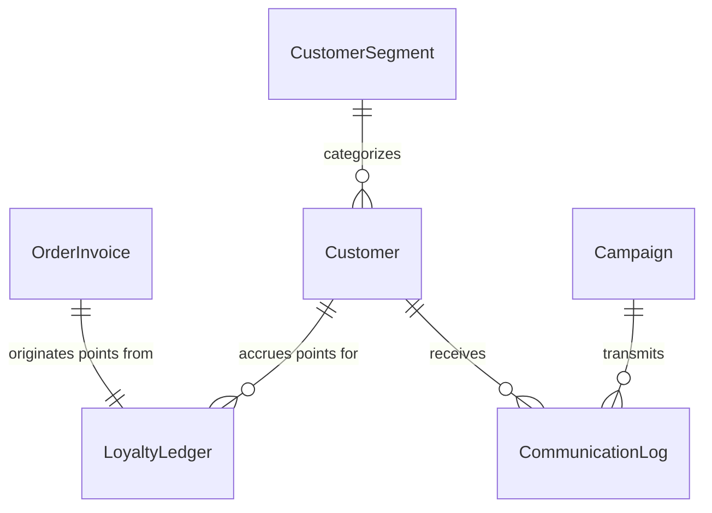
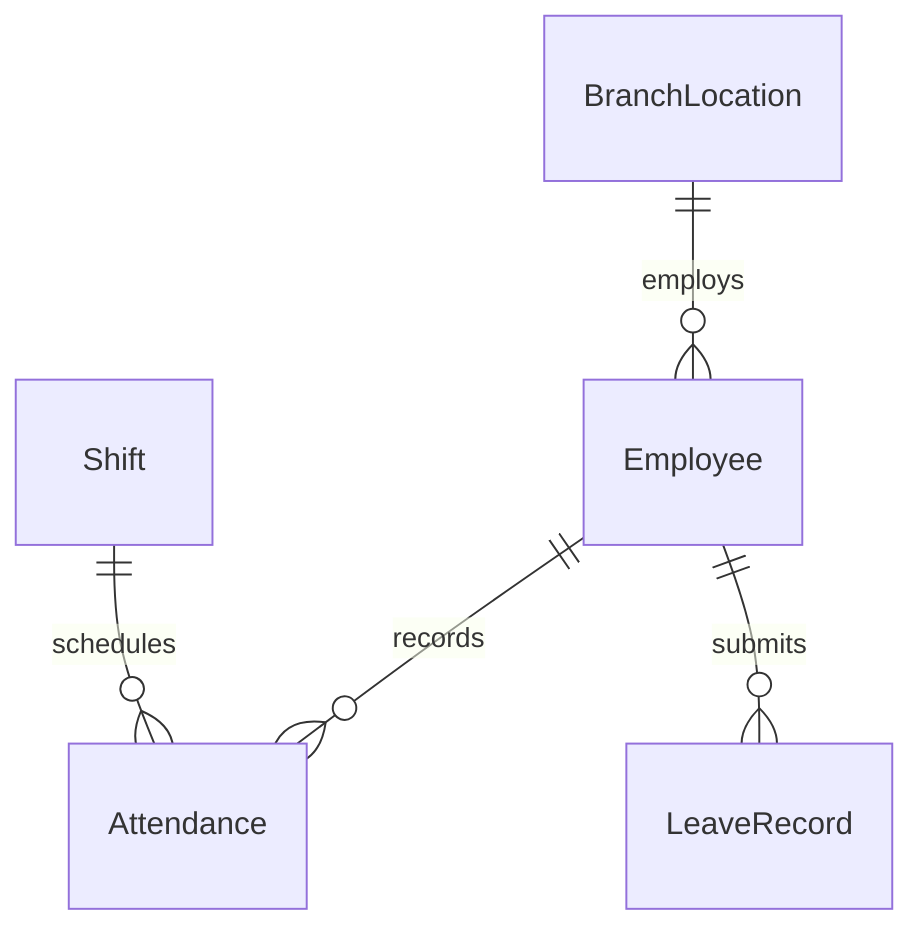
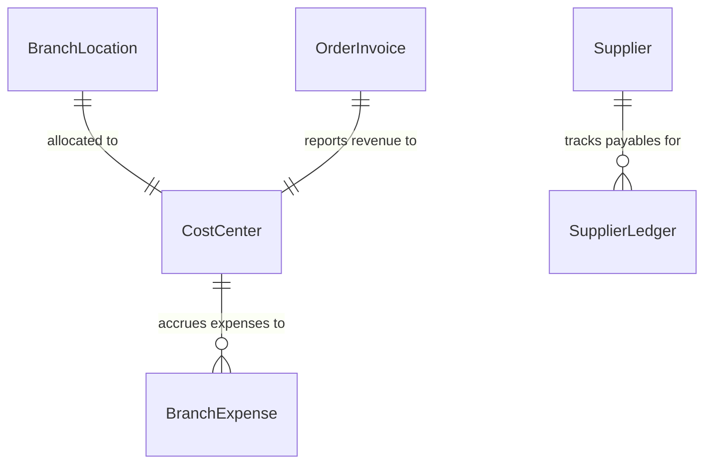

# 05. Entity Relationship Model (Logical ERD)

This document presents the logical entity relationship model for the Cakes & Candles ERP platform. It serves as the bridge between the domain definitions and the physical database layout.

---

## 1. Core Entity Directory

### Product Domain
* **Product** (PK: `product_id`)
* **ProductCategory** (PK: `category_id`)
* **ProductPricing** (PK: `pricing_id`, FK: `product_id`, `location_id`)
* **ExpiryPolicy** (PK: `policy_id`, FK: `category_id`)

### Organization & HR Domain
* **Company** (PK: `company_id`)
* **BranchLocation** (PK: `location_id`, FK: `company_id`)
* **Employee** (PK: `employee_id`, FK: `location_id`)
* **Shift** (PK: `shift_id`, FK: `employee_id`)
* **Attendance** (PK: `attendance_id`, FK: `employee_id`, `shift_id`)
* **LeaveRecord** (PK: `leave_id`, FK: `employee_id`)
* **User** (PK: `user_id`, FK: `employee_id`, `role_id`)
* **Role** (PK: `role_id`)

### Procurement Domain
* **Supplier** (PK: `supplier_id`)
* **PurchaseOrder** (PK: `po_id`, FK: `supplier_id`, `created_by`)
* **PurchaseOrderItem** (PK: `po_item_id`, FK: `po_id`, `product_id`)
* **GoodsReceivedNote** (PK: `grn_id`, FK: `po_id`, `received_by`)
* **GRNItem** (PK: `grn_item_id`, FK: `grn_id`, `product_id`)
* **SupplierInvoice** (PK: `invoice_id`, FK: `grn_id`)

### Manufacturing Domain
* **Recipe** (PK: `recipe_id`, FK: `product_id`)
* **RecipeIngredient** (PK: `ingredient_id`, FK: `recipe_id`, `product_id`)
* **ProductionPlan** (PK: `plan_id`, FK: `created_by`)
* **ProductionRun** (PK: `run_id`, FK: `plan_id`, `recipe_id`)
* **Batch** (PK: `batch_id`, FK: `run_id`, `product_id`)
* **YieldRecord** (PK: `yield_id`, FK: `batch_id`)
* **QCCheck** (PK: `qc_id`, FK: `batch_id`, `inspected_by`)

### Inventory Governance & Logistics Domain
* **StockLedger** (PK: `ledger_id`, FK: `product_id`, `batch_id`, `from_location_id`, `to_location_id`)
* **StockReservation** (PK: `reservation_id`, FK: `product_id`, `custom_cake_id`)
* **StockTransfer** (PK: `transfer_id`, FK: `from_location_id`, `to_location_id`)
* **WastageLog** (PK: `wastage_id`, FK: `product_id`, `batch_id`, `location_id`, `logged_by`, `approved_by`)
* **DispatchSheet** (PK: `dispatch_id`, FK: `from_location_id`, `to_location_id`, `driver_employee_id`)
* **DispatchItem** (PK: `dispatch_item_id`, FK: `dispatch_id`, `product_id`, `batch_id`)

### Retail Commerce (POS) & Custom Cakes Domain
* **Customer** (PK: `customer_id`)
* **OrderInvoice** (PK: `invoice_id`, FK: `customer_id`, `location_id`, `cashier_user_id`)
* **InvoiceItem** (PK: `invoice_item_id`, FK: `invoice_id`, `product_id`)
* **Payment** (PK: `payment_id`, FK: `invoice_id`)
* **CustomCakeOrder** (PK: `custom_cake_id`, FK: `invoice_id`, `assigned_chef_id`)
* **CakeDesign** (PK: `design_id`, FK: `custom_cake_id`)

### CRM & Marketing Domain
* **CustomerSegment** (PK: `segment_id`)
* **LoyaltyLedger** (PK: `loyalty_id`, FK: `customer_id`, `invoice_id`)
* **Campaign** (PK: `campaign_id`)
* **CommunicationLog** (PK: `log_id`, FK: `customer_id`, `campaign_id`)

### Finance Domain
* **CostCenter** (PK: `cost_center_id`, FK: `location_id`)
* **SupplierLedger** (PK: `supplier_ledger_id`, FK: `supplier_id`)
* **BranchExpense** (PK: `expense_id`, FK: `location_id`, `cost_center_id`)
* **CashRegisterLog** (PK: `register_log_id`, FK: `location_id`, `user_id`)

---

## 2. Relational Sub-Models (Visualizations)

### A. Inventory Ledger Relationship Model
Ensures double-entry tracking. Every movement references upstream and downstream nodes.

### B. Product-to-Recipe-to-Production Relationship
Models how ingredients translate into actual yield.

### C. POS Invoice-to-Stock Deduction Relationship
Models transaction logging and real-time inventory adjustments.

### D. Custom Cake Order Workflow Relationship
Models custom cakes as mini-projects with design specs and reservation blocks.

### E. CRM and Customer Purchase History Relationship
Ties sales to customer tiers and campaigns.

### F. HR Attendance Relationship
Tracks attendance against shifts and physical branches.

### G. Finance & Profitability Relationship
Ties costs and revenues back to location-specific cost centers.

