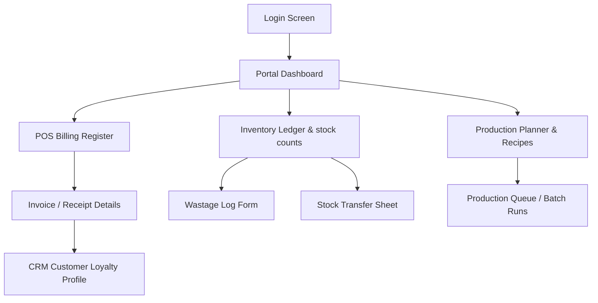

# 08. User Interface Sitemap (UI Sitemap)

This document defines the interface architecture, navigation paths, portal structures, and screen breakdowns for the Cakes & Candles ERP platform.

---

## 1. Application Structure

### Portal Layouts
The system uses a role-driven routing wrapper. Upon login, the user is redirected to their specific portal path:

```text
Login Screen
│
├── Owner Portal (Management, overrides, metrics, cost-center P&L)
├── Factory Portal (Kitchen Display System, recipe masters, plans)
├── Branch Portal (Local POS checkout with integrated CRM, stock control)
├── Dispatch Portal (Vehicle routes, load manifests)
├── CRM Portal (Campaign logs, dynamic segments)
├── HR Portal (Employee shifts, clock-ins, leaves)
└── Finance Portal (Expense logs, supplier ledgers, shift cash registers)
```

---

### A. Owner Portal
* **Owner Dashboard**: Global business health control tower with the following widgets:
  * *Today's Sales* (Real-time rupee revenue across all branches)
  * *Today's Production* (Total pieces yielded vs. planned at Factory)
  * *Low Stock Alerts* (SKUs below reorder levels)
  * *Expiring Products* (Nearing-expiry counts)
  * *Pending Dispatches* (Logistics vehicles in transit)
  * *Pending Custom Cakes* (Mini-projects currently in baking/decorating)
  * *Top Branch* (Branch rank by net profit margin)
  * *Waste %* (Wastage cost vs. total yield cost)
  * *Profit Today* (Net consolidated revenue minus cost of goods sold and branch overheads)
* **Executive Dashboard**: Consolidated revenue summaries.
* **Sales Analytics**: Branch comparisons.
* **Inventory Analytics**: Consolidated waste audit charts.
* **Production Analytics**: Factory batch yields and plan compliance tracking.
* **CRM Analytics**: Repeat purchase frequency metrics.
* **Financial Analytics**: Net P&L metrics per location cost center.
* **User Management**: Roles, system access, and passwords.
* **System Settings**: Database configuration keys, global tax (GST) thresholds, and system constants.

---

### B. Factory Portal
* **Factory Dashboard**: Quick summary of active production plans and warehouse levels.
* **Kitchen Display System (KDS)**: Operational touchscreen interface for chefs showing:
  * *Today's Production* (Consolidated batch counts)
  * *Priority Orders* (Custom cake deadlines)
  * *Custom Cakes* (Design references and chef assignments)
  * *QC Pending* (Completed runs awaiting quality audit)
  * *Dispatch Pending* (Packed finished goods ready for the transit driver)
* **Production Planning**: Interface to review branch indents and generate batch runs.
* **Production Queue**: Step-by-step queue for baking and packaging operations.
* **Recipe Management**: DDL master formulations, yields, and raw material conversion configs.
* **Raw Material Inventory**: Factory warehouse counts and supplier inwards logs.
* **Finished Goods Inventory**: Packaged goods ready for dispatch.
* **QC Management**: Inspection interface for batch yield logs.
* **Dispatch Preparation**: Packaging checks before logistics pickup.
* **Production Reports**: Yield loss charts and chef performance data.

---

### C. Branch Portal
* **Branch Dashboard**: Local store indicators (today's sales counter, low stock items).
* **POS Billing**: Checkout register, basket compiler, discount engine, and receipt printers. Includes **Integrated CRM panel**:
  * Input customer phone number -> Fetch profile showing *Name, Tier, Points Balance, Birthday, Anniversary, and Active Birthday/Anniversary Coupon Offers* -> Apply discount/points redemption instantly to the active cart.
* **Inventory Management Module** (Split views):
  * *Stock Overview*: Real-time stock counts.
  * *Inventory Ledger*: Auditable journal of every movement.
  * *Transfers*: Log and dispatch branch-to-branch requests.
  * *Expiry Management*: Flags nearing-expiry batches for conversions or promotions.
  * *Wastage Management*: Quarantine entry and reasons list.
  * *Conversion Management*: Break whole cakes into slices.
  * *Physical Audit*: Discrepancy logs.
* **Stock Requests**: Submit daily indent requests to the factory.
* **Returns**: Log customer returns.
* **Daily Closing**: Cash register reconcile logs.

---

### D. Custom Cake Portal
* **Custom Cake Dashboard**: Current pipeline counts.
* **New Order**: Custom specifications form, design sketch upload, deposit payments.
* **Order Pipeline**: Drag-and-drop Kanban view structured by production stages:
  ```text
  [BOOKED] ➔ [APPROVED] ➔ [BAKING] ➔ [DECORATING] ➔ [QC] ➔ [READY] ➔ [DELIVERED]
  ```
* **Design Approval**: Chef review station.
* **Production Status**: Kitchen timeline logs.
* **Delivery Schedule**: Assign pickups or delivery drivers.
* **Customer Communication**: WhatsApp template dispatcher.

---

### E. CRM Portal
* **CRM Dashboard**: Customer retention analytics.
* **Customers**: Profile search showing 360-degree purchase history.
* **Segments**: Rules configuration for Bronze, Silver, Gold, VIP tiers.
* **Campaigns**: Batch template sender interface.
* **Birthday Automation**: Automatic birthday coupon triggers.
* **Anniversary Automation**: Anniversary promo builders.
* **Loyalty Program**: Point conversion metrics (e.g. ₹10 = 1 point).
* **Communication History**: WhatsApp log audit board.

---

### F. Logistics Portal
* **Dispatch Dashboard**: Route status.
* **Create Dispatch**: manifest compiler, vehicle assignment, driver sheets.
* **Active Trips**: Live transit progress dashboard.
* **Delivery Confirmation**: Branch receipt interface with damage check inputs.
* **Transfer Requests**: Approve or reject branch-to-branch movements.
* **Vehicle Management**: Registrations, safety logs, availability flags.

---

### G. HR Portal
* **HR Dashboard**: Staff check-in rates and shift metrics.
* **Employees**: Team directory.
* **Attendance**: Punch logs, delays, and branch clock audits.
* **Leave**: Time-off approvals table.
* **Shift Planning**: Scheduler grid.
* **Payroll Reference**: Basic base rates, salary sheets, and calculations.

---

### H. Finance Portal
* **Finance Dashboard**: Profitability trends.
* **Supplier Ledger**: Outstanding vendor payables.
* **Expenses**: Non-ingredient overhead tracking (rent, electricity).
* **Cash Register**: Reconciliations auditing dashboard.
* **Revenue Reports**: Sales charts.
* **Profitability**: Location-based cost center reports.

---

## 2. Navigation Hierarchy

* **Global Navigation (Sidebar)**:
  - Dashboard (Home)
  - Sales (POS & Custom Orders)
  - Inventory (Ledger & Transfers)
  - Production (Plans & Recipes)
  - CRM (Customers & Campaigns)
  - Reports (KPI Snapshots)
* **Role Navigation (Dynamic Header)**:
  - Changes dynamically based on current user role (e.g. cashiers only see POS options; chefs see kitchen queues).
* **Context Navigation (Breadcrumbs & Tabs)**:
  - Contextual tabs inside modules (e.g., inside POS: "Billing Screen", "Open Invoices", "Void Requests").

---

## 3. Mobile vs. Desktop Screens

| Screen Module | Desktop | Tablet (POS View) | Mobile (Driver/Staff) |
| --- | :---: | :---: | :---: |
| **Login** | ✅ | ✅ | ✅ |
| **Owner Dashboard** | ✅ | ✅ | ❌ |
| **POS Billing Register** | ✅ | ✅ | ❌ |
| **Custom Cake Booking** | ✅ | ✅ | ❌ |
| **Custom Cake Queue** | ✅ | ✅ | ✅ |
| **Recipe Builder** | ✅ | ❌ | ❌ |
| **Factory Production Queue**| ✅ | ✅ | ❌ |
| **Wastage Logging Form** | ✅ | ✅ | ✅ |
| **Driver Dispatch Sheet** | ✅ | ✅ | ✅ |
| **Wastage Approval Board** | ✅ | ✅ | ❌ |
| **CRM Customer Search** | ✅ | ✅ | ✅ |
| **Attendance Punch In/Out** | ✅ | ✅ | ✅ |

---

## 4. MVP vs. Phase 2 Screen Inventory

### MVP Screen Scope (Launch Essentials)
1. **Login Screen**: Security gate.
2. **Dashboard**: Core widgets for Factory managers & Branch managers.
3. **POS Billing Register**: Standard product catalogs, carts, payment splits, GST invoicing.
4. **Product Master Screen**: SKU additions, basic price records, and categories.
5. **Inventory Ledger & Transfers Screen**: Request, accept, and write transactions.
6. **Wastage Input Form**: Staff wastage logs.
7. **Production Planner**: Master recipe manager and daily batch runs scheduler.
8. **Logistics Dispatch Builder**: Simple transfers and driver dispatch manifests.
9. **Daily Register Reconciliation Screen**: Opening and closing cash validation.

### Phase 2 Screen Scope (Advanced Operations)
1. **Custom Cake Intake & Pipeline Board**: Reference uploads, progress kanban, and chef assignments.
2. **CRM Campaign Manager**: Segment definitions and birthday automations.
3. **Logistics Dispatch App**: Mobile dispatcher tools for delivery drivers.
4. **HR Attendance Portal**: Shift scheduler grids and monthly attendance logs.
5. **Finance Ledger Board**: Supplier invoice audits and P&L charts.

---

## 5. Screen Inventory Count

| Portal | Dedicated Screens | Key Deliverables |
| --- | :---: | --- |
| **Owner** | 12 | P&L dashboards, global configuration, user permissions |
| **Factory** | 10 | KDS, Recipe master, Production run tracking, Yield log |
| **Branch** | 8 | POS Billing, stock requests, wastages, cake slices |
| **Logistics** | 6 | Vehicle settings, load dispatch manifests, transit check |
| **CRM** | 7 | Dynamic profiles, campaigns, loyalty records |
| **HR** | 5 | Time punch grids, leaves, shift tables |
| **Finance** | 5 | Expenses, supplier records, payment triggers |
| **Total** | **53 Screens** | Total estimated application inventory |

---

## 6. Screen Dependency Map


