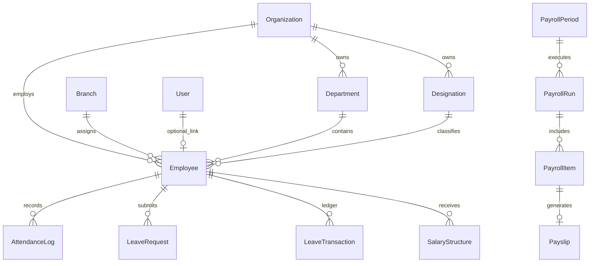

# 🏢 SPRINT 11 — HR & PAYROLL DOMAIN MODEL SPECIFICATION

> **Target Release**: Sprint 11  
> **Package**: `@cc-erp/database` (`schema.prisma`)  
> **Status**: SPECIFICATION ONLY — DO NOT APPLY MIGRATIONS YET  

---

## 1. Relational Entity ERD Graph



---

## 2. Model Field Specifications

### 2.1 Master Data Entities

```prisma
model Department {
  id             String       @id @default(uuid()) @db.Uuid
  organizationId String       @db.Uuid
  code           String
  name           String
  description    String?
  managerId      String?      @db.Uuid
  createdAt      DateTime     @default(now())
  updatedAt      DateTime     @updatedAt
  deletedAt      DateTime?

  organization   Organization @relation(fields: [organizationId], references: [id])
  employees      Employee[]

  @@unique([organizationId, code])
  @@index([organizationId])
  @@map("department")
}

model Designation {
  id             String       @id @default(uuid()) @db.Uuid
  organizationId String       @db.Uuid
  code           String
  name           String
  level          Int          @default(1)
  createdAt      DateTime     @default(now())
  updatedAt      DateTime     @updatedAt

  organization   Organization @relation(fields: [organizationId], references: [id])
  employees      Employee[]

  @@unique([organizationId, code])
  @@index([organizationId])
  @@map("designation")
}
```

### 2.2 Employee Master (`Employee`)

```prisma
enum EmploymentType {
  FULL_TIME
  PART_TIME
  CONTRACT
  INTERN
}

enum EmploymentStatus {
  DRAFT
  ACTIVE
  ON_LEAVE
  SUSPENDED
  RESIGNED
  TERMINATED
}

model Employee {
  id               String           @id @default(uuid()) @db.Uuid
  organizationId   String           @db.Uuid
  assignedBranchId String           @db.Uuid
  departmentId     String?          @db.Uuid
  designationId    String?          @db.Uuid
  userId           String?          @unique @db.Uuid
  employeeCode     String
  firstName        String
  lastName         String
  email            String?
  phone            String
  dateOfBirth      DateTime?
  dateOfJoining    DateTime
  employmentType   EmploymentType   @default(FULL_TIME)
  status           EmploymentStatus @default(DRAFT)
  bankAccountNo    String?
  bankIfscCode     String?
  panNumber        String?
  pfAccountNo      String?
  esiNumber        String?
  createdAt        DateTime         @default(now())
  updatedAt        DateTime         @updatedAt
  deletedAt        DateTime?

  organization     Organization     @relation(fields: [organizationId], references: [id])
  branch           Branch           @relation(fields: [assignedBranchId], references: [id])
  department       Department?      @relation(fields: [departmentId], references: [id])
  designation      Designation?     @relation(fields: [designationId], references: [id])
  user             User?            @relation(fields: [userId], references: [id])

  attendanceLogs   AttendanceLog[]
  leaveRequests    LeaveRequest[]
  leaveBalances    EmployeeLeaveBalance[]
  leaveTxHistory   LeaveTransaction[]
  salaryStructures SalaryStructure[]
  payrollItems     PayrollItem[]

  @@unique([organizationId, employeeCode])
  @@index([organizationId])
  @@index([assignedBranchId])
  @@index([status])
  @@map("employee")
}
```

### 2.3 Attendance & Shifts

```prisma
model ShiftMaster {
  id                   String   @id @default(uuid()) @db.Uuid
  organizationId       String   @db.Uuid
  code                 String
  name                 String
  startTime            String   // "09:00"
  endTime              String   // "18:00"
  gracePeriodMinutes   Int      @default(15)
  breakDurationMinutes Int      @default(60)
  createdAt            DateTime @default(now())
  updatedAt            DateTime @updatedAt

  @@unique([organizationId, code])
  @@map("shift_master")
}

enum AttendanceStatus {
  SCHEDULED
  CHECKED_IN
  CHECKED_OUT
  FINALIZED
}

model AttendanceLog {
  id             String           @id @default(uuid()) @db.Uuid
  organizationId String           @db.Uuid
  branchId       String           @db.Uuid
  employeeId     String           @db.Uuid
  workDate       DateTime         @db.Date
  checkInTime    DateTime?
  checkOutTime   DateTime?
  hoursWorked    Decimal?         @db.Decimal(5, 2)
  overtimeHours  Decimal?         @default(0) @db.Decimal(5, 2)
  status         AttendanceStatus @default(SCHEDULED)
  source         String           @default("BIOMETRIC") // "BIOMETRIC", "POS", "MANUAL"
  createdAt      DateTime         @default(now())
  updatedAt      DateTime         @updatedAt

  employee       Employee         @relation(fields: [employeeId], references: [id])

  @@unique([employeeId, workDate])
  @@index([organizationId])
  @@index([branchId])
  @@index([workDate])
  @@map("attendance_log")
}
```

### 2.4 Leave Ledger Entities

```prisma
model LeaveType {
  id             String   @id @default(uuid()) @db.Uuid
  organizationId String   @db.Uuid
  code           String
  name           String
  annualDays     Int
  isCarryForward Boolean  @default(false)
  createdAt      DateTime @default(now())
  updatedAt      DateTime @updatedAt

  @@unique([organizationId, code])
  @@map("leave_type")
}

model EmployeeLeaveBalance {
  id           String   @id @default(uuid()) @db.Uuid
  employeeId   String   @db.Uuid
  leaveTypeId  String   @db.Uuid
  year         Int
  allocated    Int
  used         Int      @default(0)
  balance      Int

  employee     Employee @relation(fields: [employeeId], references: [id])

  @@unique([employeeId, leaveTypeId, year])
  @@map("employee_leave_balance")
}

enum LeaveRequestStatus {
  DRAFT
  SUBMITTED
  APPROVED
  REJECTED
  CANCELLED
}

model LeaveRequest {
  id             String             @id @default(uuid()) @db.Uuid
  organizationId String             @db.Uuid
  employeeId     String             @db.Uuid
  leaveTypeId    String             @db.Uuid
  startDate      DateTime           @db.Date
  endDate        DateTime           @db.Date
  totalDays      Int
  reason         String
  status         LeaveRequestStatus @default(DRAFT)
  approvedBy     String?            @db.Uuid
  approvedAt     DateTime?
  createdAt      DateTime           @default(now())
  updatedAt      DateTime           @updatedAt

  employee       Employee           @relation(fields: [employeeId], references: [id])

  @@index([employeeId])
  @@index([status])
  @@map("leave_request")
}

model LeaveTransaction {
  id          String   @id @default(uuid()) @db.Uuid
  employeeId  String   @db.Uuid
  leaveTypeId String   @db.Uuid
  type        String   // "ACCRUAL", "DEDUCTION", "ADJUSTMENT"
  days        Int      // Positive for accrual, negative for deduction
  notes       String?
  createdAt   DateTime @default(now())

  employee    Employee @relation(fields: [employeeId], references: [id])

  @@index([employeeId])
  @@map("leave_transaction")
}
```

### 2.5 Payroll Engine Entities

```prisma
model SalaryStructure {
  id             String   @id @default(uuid()) @db.Uuid
  employeeId     String   @db.Uuid
  effectiveDate  DateTime @db.Date
  baseSalary     Decimal  @db.Decimal(12, 2)
  hra            Decimal  @default(0) @db.Decimal(12, 2)
  conveyance     Decimal  @default(0) @db.Decimal(12, 2)
  specialAllowance Decimal @default(0) @db.Decimal(12, 2)
  pfContribution Decimal  @default(0) @db.Decimal(12, 2)
  esiContribution Decimal @default(0) @db.Decimal(12, 2)
  isActive       Boolean  @default(true)
  createdAt      DateTime @default(now())
  updatedAt      DateTime @updatedAt

  employee       Employee @relation(fields: [employeeId], references: [id])

  @@index([employeeId])
  @@map("salary_structure")
}

enum PayrollRunStatus {
  DRAFT
  CALCULATING
  CALCULATED
  PENDING_APPROVAL
  APPROVED
  POSTED
  PAID
  CLOSED
}

model PayrollPeriod {
  id             String       @id @default(uuid()) @db.Uuid
  organizationId String       @db.Uuid
  year           Int
  month          Int
  startDate      DateTime     @db.Date
  endDate        DateTime     @db.Date
  status         String       @default("OPEN") // "OPEN", "CLOSED"
  createdAt      DateTime     @default(now())

  payrollRuns    PayrollRun[]

  @@unique([organizationId, year, month])
  @@map("payroll_period")
}

model PayrollRun {
  id               String           @id @default(uuid()) @db.Uuid
  organizationId   String           @db.Uuid
  payrollPeriodId  String           @db.Uuid
  runNumber        String
  status           PayrollRunStatus @default(DRAFT)
  totalEmployees   Int              @default(0)
  totalGrossPay    Decimal          @default(0) @db.Decimal(14, 2)
  totalDeductions  Decimal          @default(0) @db.Decimal(14, 2)
  totalNetPay      Decimal          @default(0) @db.Decimal(14, 2)
  idempotencyKey   String           @unique
  approvedBy       String?          @db.Uuid
  approvedAt       DateTime?
  financeExpenseId String?          @db.Uuid
  createdAt        DateTime         @default(now())
  updatedAt        DateTime         @updatedAt

  payrollPeriod    PayrollPeriod    @relation(fields: [payrollPeriodId], references: [id])
  items            PayrollItem[]

  @@unique([organizationId, runNumber])
  @@index([organizationId])
  @@index([status])
  @@map("payroll_run")
}

model PayrollItem {
  id             String     @id @default(uuid()) @db.Uuid
  payrollRunId   String     @db.Uuid
  employeeId     String     @db.Uuid
  workingDays    Int
  presentDays    Int
  lossOfPayDays  Int        @default(0)
  overtimeHours  Decimal    @default(0) @db.Decimal(5, 2)
  basePay        Decimal    @db.Decimal(12, 2)
  allowances     Decimal    @db.Decimal(12, 2)
  grossPay       Decimal    @db.Decimal(12, 2)
  pfDeduction    Decimal    @default(0) @db.Decimal(12, 2)
  esiDeduction   Decimal    @default(0) @db.Decimal(12, 2)
  taxDeduction   Decimal    @default(0) @db.Decimal(12, 2)
  otherDeductions Decimal   @default(0) @db.Decimal(12, 2)
  netPay         Decimal    @db.Decimal(12, 2)
  createdAt      DateTime   @default(now())

  payrollRun     PayrollRun @relation(fields: [payrollRunId], references: [id])
  employee       Employee   @relation(fields: [employeeId], references: [id])
  payslip        Payslip?

  @@unique([payrollRunId, employeeId])
  @@map("payroll_item")
}

enum PayslipStatus {
  GENERATED
  APPROVED
  ISSUED
}

model Payslip {
  id            String        @id @default(uuid()) @db.Uuid
  payrollItemId String        @unique @db.Uuid
  payslipNumber String        @unique
  status        PayslipStatus @default(GENERATED)
  pdfHash       String
  issuedAt      DateTime      @default(now())

  payrollItem   PayrollItem   @relation(fields: [payrollItemId], references: [id])

  @@map("payslip")
}
```
