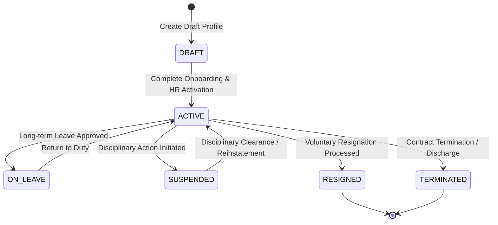
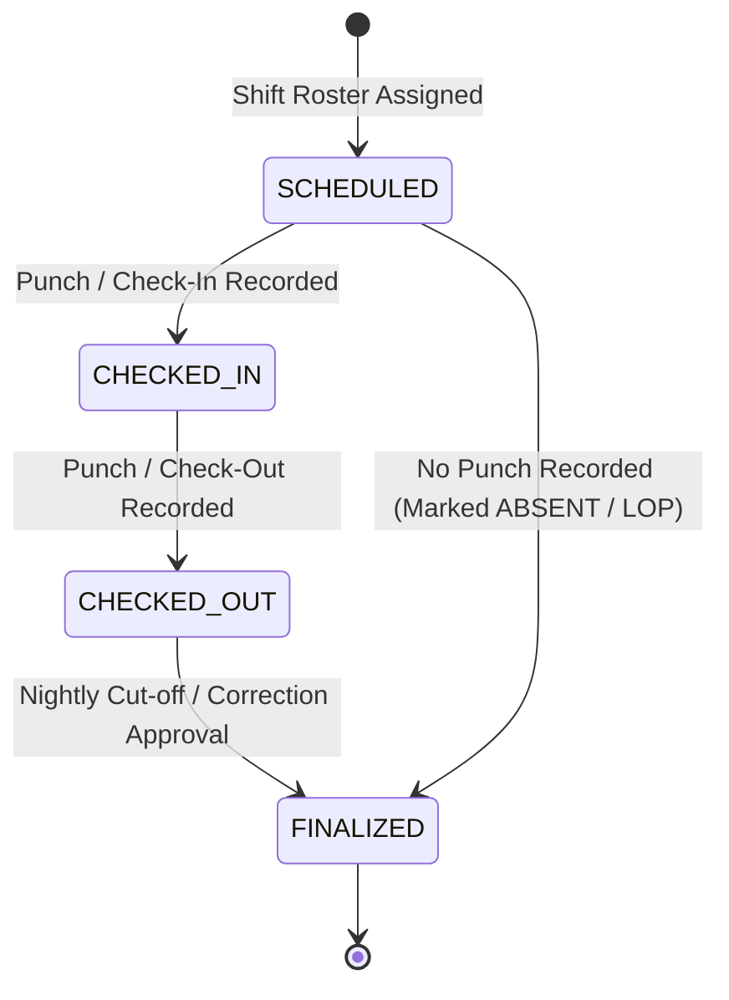
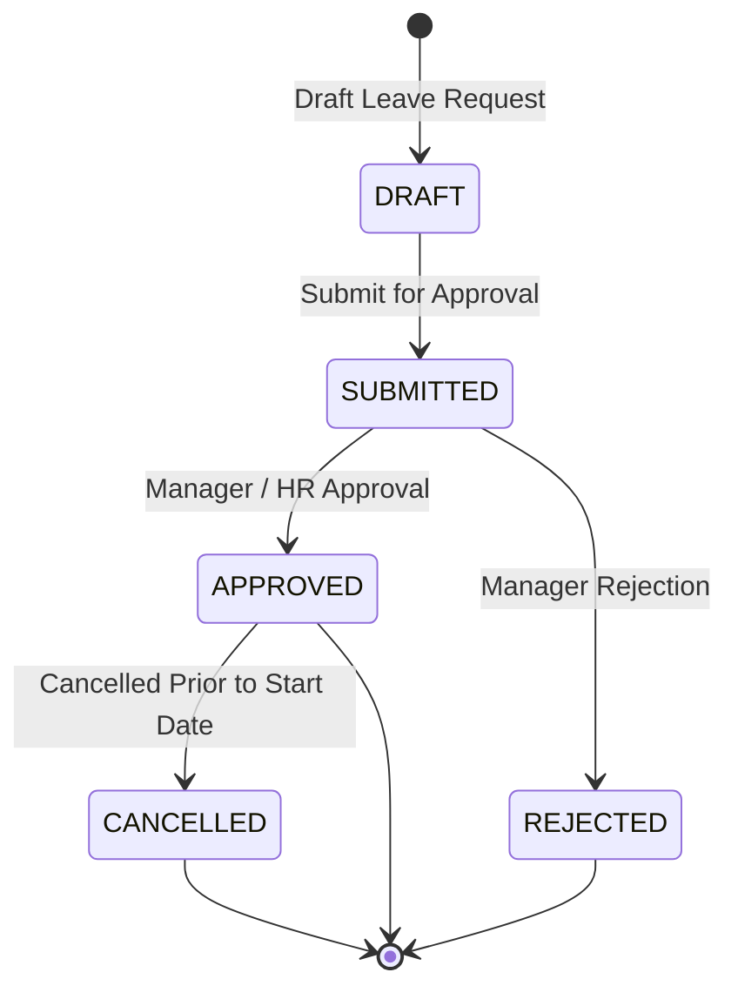
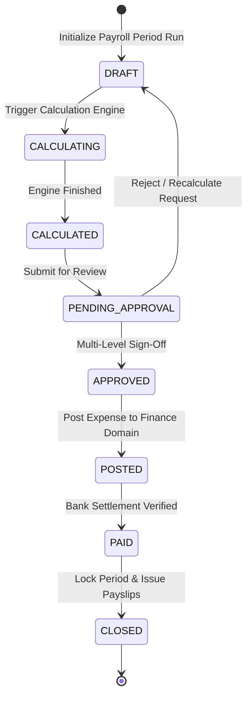
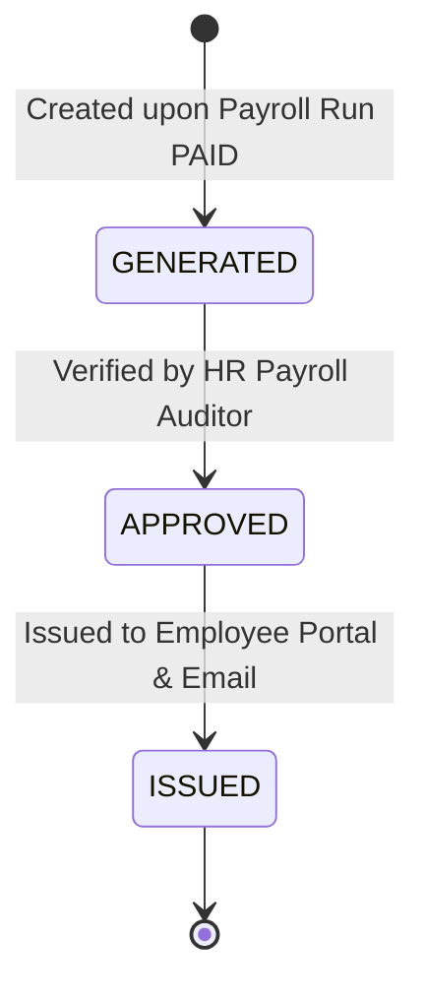

# 🔄 SPRINT 11 — HR & PAYROLL STATE MACHINES SPECIFICATION

> **Target Release**: Sprint 11  
> **Status**: CONTRACT PHASE — EXPLICIT TRANSITION RULES & GUARDS  

---

## 1. Employee Lifecycle State Machine (`Employee.status`)

### Employee Guard Rules & Side Effects

| From State | To State | Guard Condition / Trigger | Side Effects & System Actions |
| :--- | :--- | :--- | :--- |
| `DRAFT` | `ACTIVE` | Complete mandatory PII, bank details, and manager assignment | Enables login option if linked to `User`; activates shift assignment |
| `ACTIVE` | `ON_LEAVE` | Approved leave duration >= 14 consecutive days | Suspends daily attendance check alerts; notifies shift supervisor |
| `ON_LEAVE` | `ACTIVE` | Employee returns to duty on scheduled date | Restores regular shift roster alerts |
| `ACTIVE` | `SUSPENDED` | HR Director disciplinary action order | Disables `User.isActive` login access; pauses salary calculation |
| `SUSPENDED` | `ACTIVE` | HR Director clearance order | Re-enables `User.isActive` login access |
| `ACTIVE` | `RESIGNED` | Approved resignation notice period completion | Triggers Full & Final (F&F) settlement workflow |
| `ACTIVE` | `TERMINATED` | HR Director termination order | Immediately revokes `User.isActive` token; triggers F&F settlement |

---

## 2. Attendance Lifecycle State Machine (`AttendanceLog.status`)

### Attendance Guard Rules & Side Effects

| From State | To State | Guard Condition / Trigger | Side Effects & System Actions |
| :--- | :--- | :--- | :--- |
| `SCHEDULED` | `CHECKED_IN` | Biometric / POS Check-In Punch | Captures `checkInTime`; calculates late grace period minutes |
| `CHECKED_IN` | `CHECKED_OUT` | Biometric / POS Check-Out Punch | Captures `checkOutTime`; calculates total `hoursWorked` & `overtimeHours` |
| `CHECKED_OUT` | `FINALIZED` | Nightly automated job or Supervisor approval | Locks attendance record for payroll period calculation |
| `SCHEDULED` | `FINALIZED` | No check-in punch by cut-off time | Marks record `ABSENT`; queues potential Loss of Pay (LOP) day |

---

## 3. Leave Request Lifecycle State Machine (`LeaveRequest.status`)

### Leave Guard Rules & Side Effects

| From State | To State | Guard Condition / Trigger | Side Effects & System Actions |
| :--- | :--- | :--- | :--- |
| `DRAFT` | `SUBMITTED` | Valid start/end date & sufficient leave balance | Publishes `hr.leave.requested` outbox event |
| `SUBMITTED` | `APPROVED` | Authorized Manager / HR sign-off | Atomically creates negative `LeaveTransaction` (-days) & updates `used` balance |
| `SUBMITTED` | `REJECTED` | Manager rejection with mandatory reason | Notifies employee; no balance deduction |
| `APPROVED` | `CANCELLED` | Employee cancellation before leave start date | Atomically creates positive `LeaveTransaction` (+days) & restores `used` balance |

---

## 4. Payroll Run Lifecycle State Machine (`PayrollRun.status`)

### Payroll Guard Rules & Side Effects

| From State | To State | Guard Condition / Trigger | Side Effects & System Actions |
| :--- | :--- | :--- | :--- |
| `DRAFT` | `CALCULATING` | Acquire `idempotencyKey` execution lock | Locks `PayrollRun` row; aggregates attendance & leave data |
| `CALCULATING` | `CALCULATED` | Gross, deductions, and net pay computed successfully | Populates `PayrollItem` rows in DB transaction |
| `CALCULATED` | `PENDING_APPROVAL` | HR Manager submits for authorization | Creates `ApprovalRequest` in S01 Approval Engine |
| `PENDING_APPROVAL` | `APPROVED` | Manager + Finance + HR Director sign-off | Unlocks payroll for financial posting |
| `APPROVED` | `POSTED` | Execute `FinanceService.postExpense()` | Inserts `Expense` & `JournalEntry` into S08 Finance Domain |
| `POSTED` | `PAID` | Bank disbursement confirmation received | Updates status to `PAID`; triggers payslip generation |
| `PAID` | `CLOSED` | Lock period cut-off | Locks `PayrollRun` & `Payslip` rows permanently against modification |

---

## 5. Payslip Generation State Machine (`Payslip.status`)

### Payslip Guard Rules & Side Effects

| From State | To State | Guard Condition / Trigger | Side Effects & System Actions |
| :--- | :--- | :--- | :--- |
| `[*]` | `GENERATED` | `PayrollRun.status` transitions to `PAID` | Generates immutable `Payslip` row and SHA-256 PDF hash |
| `GENERATED` | `APPROVED` | HR Auditor signature | Marks payslip verified for release |
| `APPROVED` | `ISSUED` | Dispatch trigger | Renders payslip in Employee 360 portal; sends email notification |
