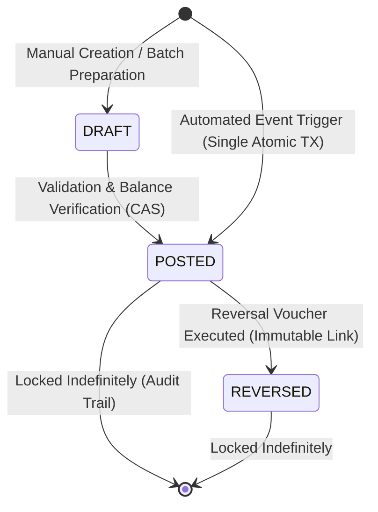
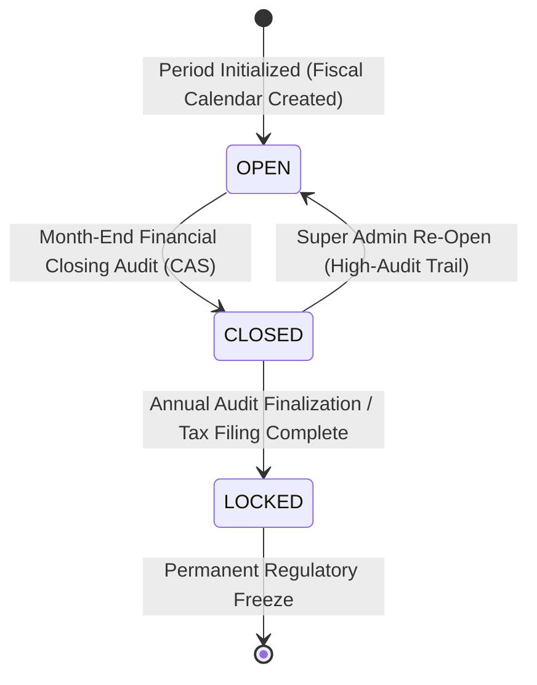
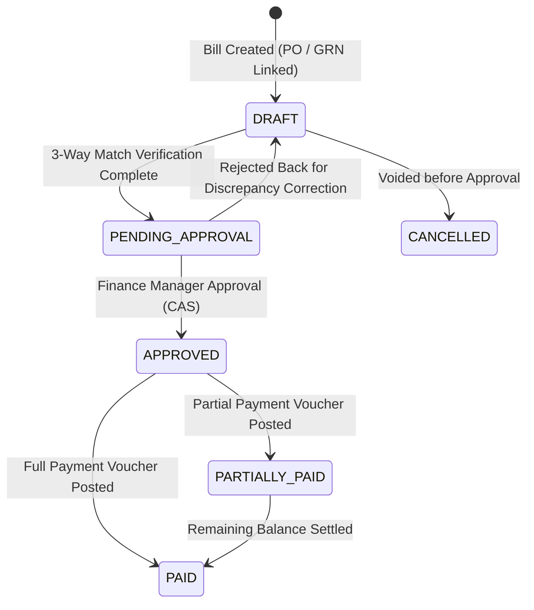
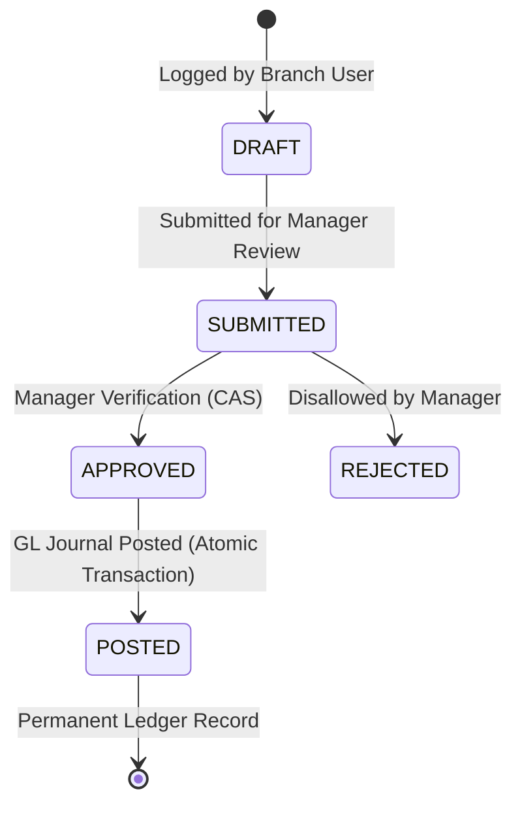

# 🔄 FINANCE STATE MACHINES & LIFECYCLES
## Accounting State Transitions, CAS Guards & Reversal Protocols

> **Sprint**: Sprint 12 — Finance & Accounting  
> **Status**: FROZEN (Phase 12.1)  
> **Classification**: State Machine & Invariant Contract  

---

## 1. General Ledger Journal Entry State Machine



### 1.1 State Invariants:
- **`DRAFT`**: Optional intermediate state for manual accounting adjustments or unposted staging batches. Editable only by authorized accountants.
- **`POSTED`**: Immutable state. $\sum \text{Debits} \equiv \sum \text{Credits}$. Generates permanent financial balances. Cannot be modified or deleted under any circumstance.
- **`REVERSED`**: Terminal state. Marked when a compensating offset journal (`reversalEntryId`) is posted. Both original and reversal entries remain forever visible in the ledger.

---

## 2. Fiscal Period State Machine



### 2.1 State Rules:
- **`OPEN`**: Journal postings accepted within date range `startDate <= postingDate <= endDate`.
- **`CLOSED`**: All automated and manual posting attempts rejected with `400 Bad Request` (`FISCAL_PERIOD_CLOSED`). Reopening requires `finance:period:reopen` permission and logs a critical `AuditLog`.
- **`LOCKED`**: Year-end audit sealed. Cannot be reopened by any user role.

---

## 3. Accounts Payable Supplier Bill State Machine



---

## 4. Operational Expense State Machine



---

## 5. Reversal & Replacement State Protocol

When an erroneous or disputed transaction has already been posted to the General Ledger:

```text
Original Journal Entry (JE-001) [POSTED]
              │
              ▼
   Execute Reversal Workflow
              │
              ├── Create Offset Journal Entry (JE-002) [POSTED]
              │   • Inverts all Debit & Credit lines from JE-001
              │   • description: "Reversal of JE-001: [Reason]"
              │   • reversalOf = JE-001.id
              │
              ├── Update JE-001 status to REVERSED (reversalEntryId = JE-002.id)
              │
              └── Post Corrected Journal Entry (JE-003) [POSTED]
                  • Contains the true and corrected debits/credits
```
> [!IMPORTANT]
> Financial data integrity is maintained because historical trial balances remain 100% auditable with explicit journal lineage.
