# 🏛️ SPRINT 12 — ARCHITECTURE DISCOVERY & AUDIT REPORT
## Finance & Double-Entry Accounting Domain Discovery

> **Sprint**: Sprint 12 — Architecture Discovery Phase  
> **Status**: DISCOVERY COMPLETE (Zero Code Modified)  
> **Date**: 2026-09-03  
> **Repository**: `Cakes & Candles ERP`  

---

## 1. Executive Summary & Objective
This audit analyzes the existing Finance and Accounting implementation in Cakes & Candles ERP to establish the foundational architectural baseline for **Sprint 12 (Finance & Double-Entry Accounting)**. 

### Core Discovery Findings:
1. **Single Source of Truth Mandate**: Finance must serve as the central, authoritative financial ledger for the entire ERP. Upstream business operations (Procurement, Sales, POS, Payroll, Inventory, Branch Transfers) must interface with Finance through structured posting workflows without creating duplicate accounting ledgers.
2. **Current Implementation Baseline**: The existing `apps/api/src/modules/finance/` provides early operational utilities (`POSRegister` management, simulated `Expense` logging, on-the-fly `SupplierLedger` calculation from Purchase Orders, and the `postPayrollExpense` integration established in Sprint 11 Phase 3D).
3. **Prisma Schema State**: Formal double-entry General Ledger models (`Account`, `JournalEntry`, `JournalEntryLine`, `FiscalPeriod`, `SupplierBill`, `PaymentVoucher`) do not yet exist in `@cc-erp/database` schema.
4. **Clean Slate for Enterprise Ledger**: Sprint 12 will introduce a robust, audit-compliant double-entry accounting engine preserving backward compatibility with all existing endpoints and UI pages.

---

## 2. Existing Finance Domain Inventory

### 2.1 Backend Implementation (`apps/api/src/modules/finance/`)
The module consists of:
- [`finance.module.ts`](file:///Applications/XAMPP/xamppfiles/htdocs/Cakes&Candels/apps/api/src/modules/finance/finance.module.ts): Module registration exporting `FinanceService`.
- [`finance.controller.ts`](file:///Applications/XAMPP/xamppfiles/htdocs/Cakes&Candels/apps/api/src/modules/finance/finance.controller.ts): REST endpoints protected by `JwtAuthGuard` and `DevTokenGuard`.
- [`finance.service.ts`](file:///Applications/XAMPP/xamppfiles/htdocs/Cakes&Candels/apps/api/src/modules/finance/finance.service.ts): Service implementing 5 functional areas:

| Functional Area | Current Method | Current Data Source | Architectural Assessment & Gap |
| :--- | :--- | :--- | :--- |
| **Branch Expenses** | `createExpense`<br>`getExpenses`<br>`getExpenseSummary` | `(prisma as any).expense` | Expense categories are hardcoded (`RENT`, `ELECTRICITY`, `DIESEL`, `WATER`, `PETTY_CASH`, `INTERNET_TELECOM`, `MAINTENANCE`, `SALARY`). Needs formal `Expense` model and automated GL posting. |
| **Payroll Posting** | `postPayrollExpense` | Simulated `expenseRecord` & `(prisma as any).expense` | Implemented in Sprint 11 Phase 3D with mathematical reconciliation ($\text{Gross} = \text{Net} + \text{Deductions}$). Needs integration into General Ledger journal entries (`Dr. Salary Expense`, `Cr. Payroll Payable`). |
| **POS Cash Registers** | `openRegister`<br>`closeRegister`<br>`managerApproveClosing`<br>`getRegisterExpectedTotals` | `model POSRegister`<br>`model PosShift`<br>`model Payment` | Manages register opening/closing, cashier variance, and expected cash/UPI/card totals. Ready for automated Daily Cash/Bank Journal posting. |
| **Supplier Payables** | `getSupplierLedger` | Dynamic calculation on `model PurchaseOrder` | Currently computes unbilled payables by filtering `PurchaseOrder.status === 'RECEIVED'`. Needs formal Accounts Payable (`SupplierBill`, `SupplierPayment`) with 3-way matching against GRNs. |
| **KPI Reporting** | `getKPIReport` | Aggregate of `SalesOrder` vs `Expense` | Basic sales vs expenses subtraction. Needs full Trial Balance, P&L, and Balance Sheet generation. |

### 2.2 Database Schema State (`packages/database/prisma/schema.prisma`)
- **Existing Upstream Financial Entities**:
  - `Organization` & `Branch` (Multi-tenant foundation)
  - `POSRegister` & `PosShift` & `PosShiftCashMovement` (Cash tracking)
  - `PurchaseOrder` & `GoodsReceiptNote` (Procurement commitments & receipts)
  - `SalesOrder`, `Payment`, `PaymentIntent`, `Refund` (Commercial revenue & receipts)
  - `PayrollRun` (`financeExpenseId String? @db.Uuid`)
  - `InventoryTransaction` & `WastageLog` (Physical stock movements)
- **Missing Double-Entry Models**:
  - `ChartOfAccounts` / `Account`
  - `JournalEntry` & `JournalEntryLine`
  - `FiscalYear` & `FiscalPeriod`
  - `SupplierInvoice` / `APBill` & `SupplierPayment`
  - `CustomerInvoice` / `ARInvoice`
  - `Expense` (Formal table)
  - `TaxLedger` / `GSTTransaction`

### 2.3 Web Admin Frontend (`apps/web-admin/src/pages/finance/`)
- `Expenses.tsx`: UI for branch managers and accountants to log operational expenses with category color tags.
- `CashRegisters.tsx`: UI for opening, closing, and approving register cash reconciliations.
- `SupplierLedger.tsx`: UI displaying supplier outstanding balances and pending PO counts.

---

## 3. Comprehensive End-to-End Accounting Flow Architecture

In Sprint 12, Finance will establish double-entry accounting hooks across all operational domains:

```text
                               ┌─────────────────────────────────────────┐
                               │       FINANCE / ACCOUNTING DOMAIN       │
                               │        Single Financial Source          │
                               ├─────────────────────────────────────────┤
                               │  • Chart of Accounts (COA)              │
                               │  • General Ledger (Journal Entries)     │
                               │  • Fiscal Periods & Period Locking      │
                               │  • Accounts Payable (3-Way Matching)    │
                               │  • Accounts Receivable & POS Settlement │
                               │  • Tax & GST Ledgers                    │
                               │  • Financial Statements (TB, P&L, BS)   │
                               └────────────────────┬────────────────────┘
                                                    │
         ┌───────────────────┬──────────────────────┼─────────────────────┬──────────────────┐
         │                   │                      │                     │                  │
         ▼                   ▼                      ▼                     ▼                  ▼
   [PROCUREMENT]          [SALES]               [PAYROLL]            [INVENTORY]          [BRANCH]
   PO → GRN → Bill    Order → Payment        Run → Approval       Receipt/Wastage       Transfer Out
         │                   │                      │                     │                  │
   Dr. Inventory/Exp   Dr. Bank/Cash          Dr. Salary Expense   Dr. Wastage Expense   Dr. Inter-Branch
   Cr. Accounts Pay.   Cr. Revenue/Tax        Cr. Payroll Payable  Cr. Inventory Asset   Cr. Inter-Branch
```

### 3.1 Procurement & Accounts Payable (AP) Flow
1. **Purchase Order**: Commitment recorded (no financial ledger impact).
2. **Goods Receipt Note (GRN)**:
   - $\text{Dr. Inventory / Raw Materials Asset}$
   - $\text{Cr. GRN Clearing / Unbilled AP Liability}$
3. **Supplier Invoice / AP Bill (3-Way Match: PO + GRN + Bill)**:
   - $\text{Dr. GRN Clearing / Unbilled AP Liability}$
   - $\text{Dr. Input Tax Credit (GST)}$
   - $\text{Cr. Accounts Payable (Supplier)}$
4. **Supplier Payment**:
   - $\text{Dr. Accounts Payable (Supplier)}$
   - $\text{Cr. Bank / Cash Account}$

### 3.2 Sales & Accounts Receivable (AR) Flow
1. **POS / Storefront Order Confirmed**:
   - $\text{Dr. Accounts Receivable / Payment Gateway Clearing}$
   - $\text{Cr. Sales Revenue}$
   - $\text{Cr. Output GST Liability}$
2. **Payment Captured / POS Register Reconciled**:
   - $\text{Dr. Cash / Bank Account}$
   - $\text{Cr. Accounts Receivable / Payment Gateway Clearing}$
3. **Refund / Return Processed**:
   - $\text{Dr. Sales Return / Revenue}$
   - $\text{Dr. Output GST Liability Reversal}$
   - $\text{Cr. Cash / Bank / Refund Payable}$

### 3.3 Payroll & Employee Compensation Flow
1. **Payroll Calculated & Approved** (`APPROVED` state):
   - Review and lock.
2. **Finance Posting** (`POSTED` state):
   - $\text{Dr. Salary Expense (Gross Pay)}$
   - $\text{Cr. Statutory Deductions Payable (PF, ESI, Professional Tax)}$
   - $\text{Cr. Net Payroll Payable (Employee Take-Home)}$
3. **Salary Disbursement / Payout**:
   - $\text{Dr. Net Payroll Payable}$
   - $\text{Cr. Bank Account}$

### 3.4 Inventory Valuation & Wastage Flow
1. **Production Output**:
   - $\text{Dr. Finished Goods Inventory}$
   - $\text{Cr. Work-In-Progress (WIP) / Raw Materials}$
2. **Wastage Approved**:
   - $\text{Dr. Inventory Wastage Expense}$
   - $\text{Cr. Inventory Asset}$

---

## 4. Proposed Sprint 12 Domain Model Blueprint

```mermaid
classDiagram
    class Organization {
        +UUID id
        +String name
        +String code
    }

    class Account {
        +UUID id
        +String code
        +String name
        +AccountType type
        +AccountCategory category
        +Boolean isReconciled
        +Boolean isActive
    }

    class FiscalYear {
        +UUID id
        +String name
        +DateTime startDate
        +DateTime endDate
        +Boolean isClosed
    }

    class FiscalPeriod {
        +UUID id
        +Int periodNumber
        +DateTime startDate
        +DateTime endDate
        +PeriodStatus status
    }

    class JournalEntry {
        +UUID id
        +String entryNumber
        +DateTime postingDate
        +String sourceModule
        +UUID sourceEntityId
        +String referenceNumber
        +JournalStatus status
        +Decimal totalDebit
        +Decimal totalCredit
    }

    class JournalEntryLine {
        +UUID id
        +UUID accountId
        +Decimal debitAmount
        +Decimal creditAmount
        +String description
        +UUID branchId
    }

    class SupplierBill {
        +UUID id
        +String billNumber
        +UUID supplierId
        +UUID poId
        +UUID grnId
        +DateTime billDate
        +DateTime dueDate
        +Decimal subtotal
        +Decimal taxAmount
        +Decimal totalAmount
        +BillStatus status
    }

    class SupplierPayment {
        +UUID id
        +String paymentNumber
        +UUID supplierId
        +UUID billId
        +Decimal amount
        +PaymentMethod method
        +DateTime paymentDate
    }

    Organization "1" --> "*" Account
    Organization "1" --> "*" FiscalYear
    FiscalYear "1" --> "*" FiscalPeriod
    Organization "1" --> "*" JournalEntry
    JournalEntry "1" --> "2..*" JournalEntryLine
    Account "1" --> "*" JournalEntryLine
    Organization "1" --> "*" SupplierBill
    SupplierBill "1" --> "*" SupplierPayment
```



---

## 5. Critical Invariants for Sprint 12 Architecture

1. **Zero Duplicate Ledgers**: All financial impacts must resolve to the single General Ledger (`JournalEntry` & `JournalEntryLine`).
2. **Double-Entry Mathematical Invariant**:
   $$\sum \text{Debit Amounts} \equiv \sum \text{Credit Amounts} \quad (\Delta = 0.00)$$
   Unbalanced journal entries must be rejected at the database / transaction boundary.
3. **Fiscal Period Locking**: Transactions cannot post into closed fiscal periods.
4. **Idempotency & Concurrency**:
   - Automated posting from upstream events (Payroll, GRN, Sales Orders) must use unique `(sourceModule, sourceEntityId)` or `idempotencyKey` constraints to prevent double-posting.
   - CAS state machines for all invoices, payments, and journal batches.
5. **Multi-Tenant & Branch Scoping**:
   - Accounts and Journal Entries must strictly isolate by `organizationId`.
   - Journal lines capture `branchId` for location-level P&L and Balance Sheet segmentation.
6. **Backward Compatibility**: Existing endpoints (`/finance/expenses`, `/finance/cash-registers`, `/finance/supplier-ledger`, `/finance/reports/kpis`) and frontend pages must continue functioning seamlessly while backed by the robust General Ledger.

---

## 6. Audit Conclusion & Readiness

- **Current State**: Fully discovered and documented.
- **Sprint 11**: 100% certified and frozen.
- **Sprint 12**: Architecture discovery phase complete. Ready for formal Architecture Contract and Phase Plan definition.
